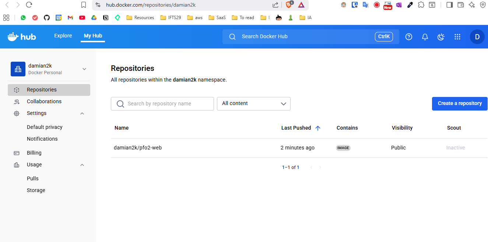
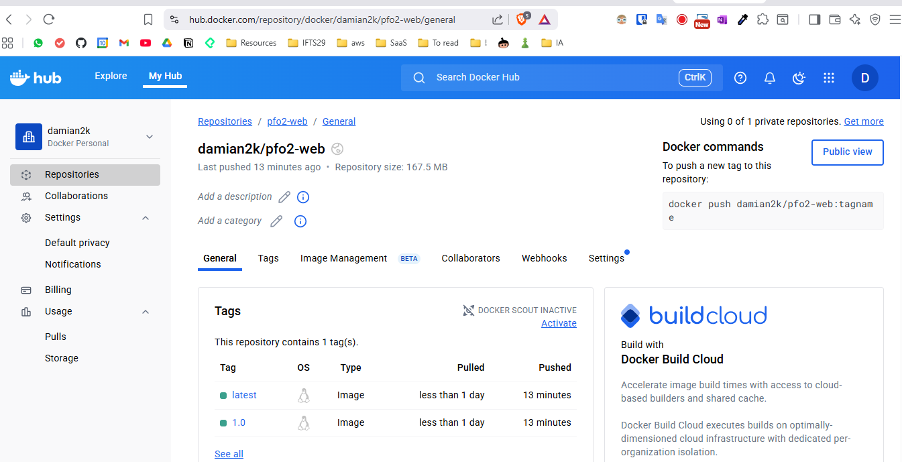
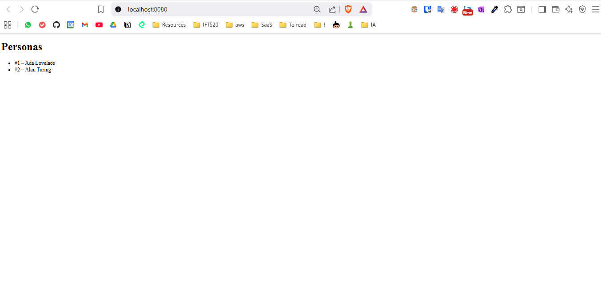
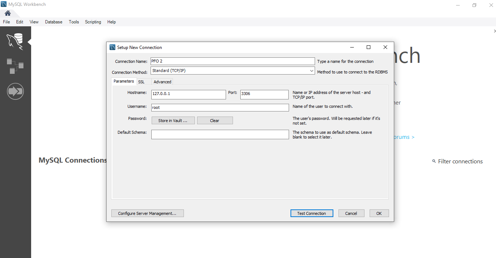
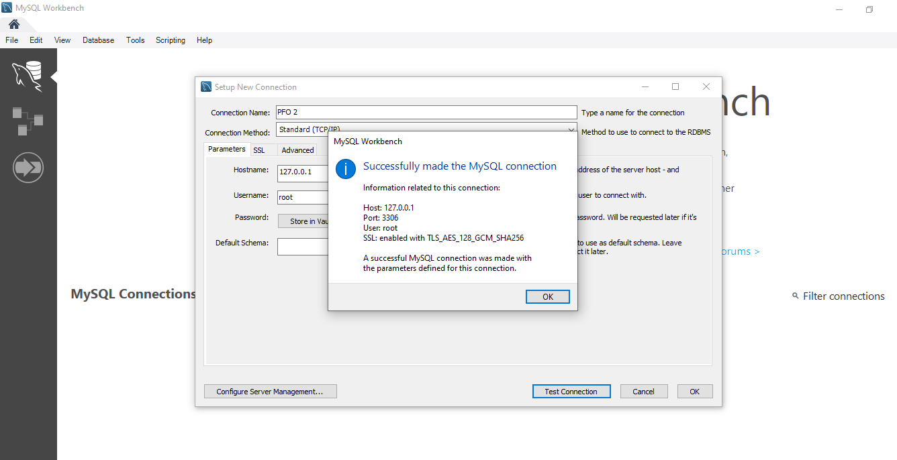
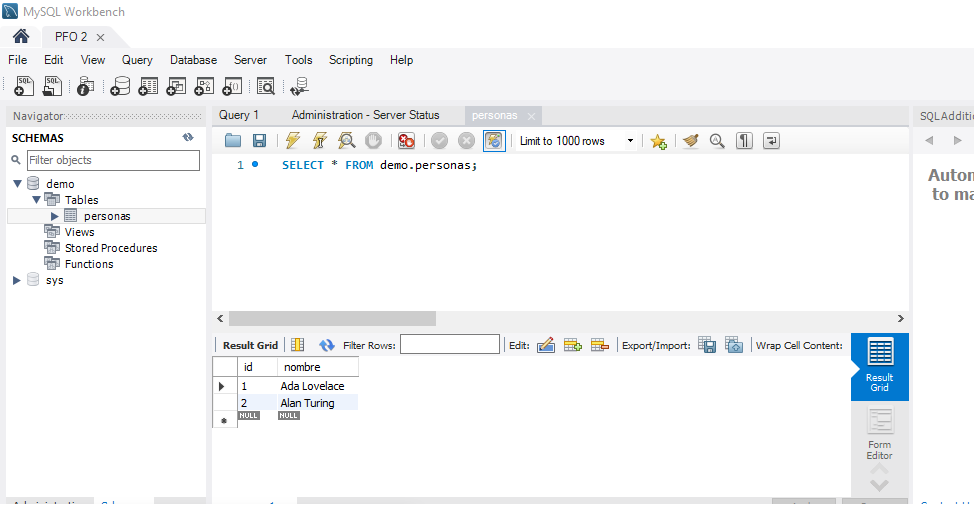

# IFTS 29 - Tecnicatura en Desarrollo de Software

## Seminario de actualización DevOps - 3° D

**Práctica formativa obligatorio 2**

**Alumno:** Damián Andrés Clausi

**Profesor:** Javier Blanco

## 1) Objetivo

* Levantar un stack **Web + Base de Datos** con Docker.
* Crear una **página de inicio** que lea datos desde MySQL.
* Generar **imagen propia** de la web y **publicarla** en Docker Hub.
* Subir el proyecto a **GitHub**, documentando comandos y evidencias.

---

## 2) Arquitectura

```text
Navegador → http://localhost:8080 → [ web (PHP+Apache) ] --(bridge)--> [ db (MySQL 8) ]
```

* **web:** PHP 8.2 + Apache, conecta a MySQL vía PDO/MySQL.
* **db:** MySQL 8, datos persistidos en volumen Docker.

---

## 3) Requisitos

* Docker Desktop/Engine (con daemon corriendo).
* (Opcional) MySQL Workbench para visualización/SQL GUI.
* Cuenta en **Docker Hub** y **GitHub**.

---

## 4) Estructura del repositorio

```text
./
├─ Dockerfile
├─ docker-compose.yml              # Usa la imagen publicada en Docker Hub
├─ docker-compose.yml.local        # Variante para build local (documentación y pruebas)
├─ .env.example                    # Variables de entorno (sin secretos)
├─ .gitignore                      # Evita subir .env real
├─ src/
│  └─ index.php                    # Home que crea tabla y lista registros
└─ screenshots/
   ├─ dockerhub1.png               # Vista general del repo en Docker Hub
   ├─ dockerhub2.png               # Vista de tags en Docker Hub
   └─ localhost.png                # Home en http://localhost:8080
```

---

## 5) Variables de entorno (`.env`)

Crear un archivo **`.env`** (no se sube al repo). Parámetros usados en la práctica:

```dotenv
MYSQL_ROOT_PASSWORD=secret
MYSQL_DATABASE=demo
MYSQL_USER=demo
MYSQL_PASSWORD=demo
```

> En el repo incluimos **`.env.example`** con valores de ejemplo/placeholder. **No subir** `.env` real.

---

## 6) Ejecución

### 6.1 Usando la imagen publicada en Docker Hub (recomendado para la entrega)

```bash
# Levantar todos los servicios en modo "daemon" (segundo plano)
-d: ejecuta contenedores en background, libera la terminal
docker-compose up -d

# Una vez levantado, acceder a:
# Web: http://localhost:8080
```

### 6.2 Forzar pull desde Docker Hub (validación)

```bash
# Detener todos los servicios del compose
docker-compose down

# Eliminar imágenes locales para forzar descarga desde Docker Hub
# || true: continúa aunque la imagen no exista (evita errores)
docker rmi pfo2-web:latest || true
docker rmi damian2k/pfo2-web:1.0 || true

# Levantar servicios (forzará pull desde Docker Hub)
docker-compose up -d
```

### 6.3 Construcción local (variante `docker-compose.yml.local`)

```bash
# Usar archivo compose alternativo para build local
# -f: especifica archivo compose personalizado
# --build: fuerza rebuild de imágenes (ignora cache)
docker-compose -f docker-compose.yml.local up -d --build
```

---

## 7) Comandos ejecutados (con explicación)

> **Nota:** los siguientes comandos se usaron a lo largo de la práctica y/o como guía para cumplir cada ítem de la PFO.

### 7.1 Imágenes, contenedores y logs

```bash
# Ver estado y salud de todos los servicios
# Muestra: nombre, imagen, comando, estado, puertos
docker-compose ps

# Ver información detallada de las imágenes Docker utilizadas
# Incluye: repositorio, tag, plataforma, ID, tamaño
docker-compose images

# Ver logs en tiempo real de cada servicio
# --tail 50: muestra solo las últimas 50 líneas
docker-compose logs db --tail 50
docker-compose logs web --tail 50

# Para seguir logs en vivo agregar -f:
# docker-compose logs -f web
```

### 7.2 Build/Tag/Push de la imagen propia

```bash
# Construir imagen local usando Dockerfile del directorio actual
# -t: asigna tag/nombre a la imagen
docker build -t pfo2-web:latest .

# Crear tags adicionales para publicar en Docker Hub
# Formato: docker tag <imagen-local> <usuario-dockerhub>/<repo>:<version>
docker tag pfo2-web:latest damian2k/pfo2-web:1.0
docker tag pfo2-web:latest damian2k/pfo2-web:latest

# Publicar imágenes en Docker Hub (requiere docker login previo)
# Se publican ambas versiones: específica (1.0) y latest
docker push damian2k/pfo2-web:1.0
docker push damian2k/pfo2-web:latest

# Nota: docker login debe ejecutarse antes del primer push
# docker login -u damian2k
```

### 7.3 SQL de inicialización (si la home no autogenera datos)

```sql
CREATE TABLE IF NOT EXISTS personas (
  id INT AUTO_INCREMENT PRIMARY KEY,
  nombre VARCHAR(100) NOT NULL
);
INSERT INTO personas (nombre) VALUES ('Ada Lovelace'), ('Alan Turing');
```

> También puede ejecutarse por CLI (desde terminal del host):

```bash
# Ejecutar comandos SQL directamente en el contenedor MySQL
# exec -T: ejecuta comando sin TTY (permite redirección)
# <<'SQL': heredoc, permite comandos SQL multilínea
docker-compose exec -T db mysql -u"$MYSQL_USER" -p"$MYSQL_PASSWORD" "$MYSQL_DATABASE" <<'SQL'
CREATE TABLE IF NOT EXISTS personas (
  id INT AUTO_INCREMENT PRIMARY KEY,
  nombre VARCHAR(100) NOT NULL
);
INSERT INTO personas (nombre) VALUES ('Ada Lovelace'), ('Alan Turing');
SQL

# Alternativa: ejecutar SQL desde archivo
# docker-compose exec -T db mysql -u"$MYSQL_USER" -p"$MYSQL_PASSWORD" "$MYSQL_DATABASE" < script.sql
```

### 7.4 Bajar/levantar el stack

```bash
# Detener todos los servicios del proyecto
# Los contenedores se paran pero conservan datos y configuración
docker-compose down

# PELIGRO: Detener y eliminar TODOS los datos persistentes
# -v: elimina volúmenes nombrados (pérdida total de datos MySQL)
docker-compose down -v

# Levantar servicios nuevamente
# Comportamiento depende del archivo compose usado:
# - docker-compose.yml: hace pull de imagen desde Docker Hub
# - docker-compose.yml.local: hace build local de imagen
docker-compose up -d

# Comandos adicionales útiles:
# docker-compose restart web    # Reiniciar solo servicio web
# docker-compose stop          # Parar sin eliminar contenedores
# docker-compose start         # Iniciar contenedores existentes
```

### 7.5 Comandos de troubleshooting y debugging

```bash
# Verificar estado de servicios y diagnóstico
docker-compose ps -a              # Ver todos los contenedores (incluso parados)
docker-compose top               # Ver procesos ejecutándose en contenedores

# Inspección detallada de servicios
docker inspect pfo2-web          # Información completa del contenedor web
docker inspect pfo2-mysql        # Información completa del contenedor MySQL

# Acceso interactivo a contenedores para debugging
docker-compose exec web bash     # Shell interactivo en contenedor web
docker-compose exec db bash      # Shell interactivo en contenedor MySQL

# Verificar conectividad de red entre contenedores
docker-compose exec web ping db  # Probar conectividad web -> db
docker network ls                # Listar redes Docker
docker network inspect pfo2_default  # Inspeccionar red del proyecto

# Monitoreo de recursos y rendimiento
docker stats                     # Ver uso de CPU/memoria en tiempo real
docker-compose logs -f --tail=100   # Seguir logs de todos los servicios

# Limpieza y mantenimiento
docker system prune              # Eliminar recursos no utilizados
docker volume ls                 # Listar volúmenes persistentes
docker images | grep pfo2        # Ver imágenes relacionadas al proyecto

# Validar configuración antes de ejecutar
docker-compose config            # Verificar sintaxis del compose
docker-compose config --services # Listar servicios definidos
```

---

## 8) Evidencias (salidas reales)

### 8.1 `docker-compose ps`

```text
NAME         IMAGE                   COMMAND                  SERVICE   CREATED         STATUS                   PORTS
pfo2-mysql   mysql:8.0               "docker-entrypoint.s…"   db        6 minutes ago   Up 6 minutes (healthy)   0.0.0.0:3306->3306/tcp, [::]:3306->3306/tcp
pfo2-web     damian2k/pfo2-web:1.0   "docker-php-entrypoi…"   web       6 minutes ago   Up 6 minutes             0.0.0.0:8080->80/tcp, [::]:8080->80/tcp
```

### 8.2 `docker-compose images`

```text
CONTAINER    REPOSITORY          TAG   PLATFORM     IMAGE ID      SIZE   CREATED
pfo2-mysql   mysql               8.0   linux/amd64  d2fdd0af2893  236MB  32 minutes ago
pfo2-web     damian2k/pfo2-web   1.0   linux/amd64  a955c2812b47  176MB   7 minutes ago
```

### 8.3 Capturas incluidas en `./screenshots/`

#### Docker Hub

* `dockerhub1.png`: vista general del repositorio en Docker Hub.
* `dockerhub2.png`: vista de **tags** en Docker Hub.





#### Aplicación Web

* `localhost.png`: Home en `http://localhost:8080` con el listado de personas.



#### MySQL Workbench

* `mysql1.png`: Conexión desde MySQL Workbench al contenedor MySQL.
* `mysql2.png`: Vista de la base de datos `demo` y tabla `personas` en MySQL Workbench.
* `mysql3.png`: Consulta SELECT mostrando los datos de la tabla `personas`.







> **Aviso Compose:** si aparece `the attribute version is obsolete`, se puede **eliminar** la línea `version:` del compose sin afectar el funcionamiento.

---

## 9) Conexión con MySQL Workbench

Para cumplir con el punto 6 de la PFO2 ("Desde MySQL Workbench conectarse al servidor y crear una base de datos con una tabla"):

### 9.1 Configuración de la conexión

1. **Abrir MySQL Workbench**
2. **Crear nueva conexión** con los siguientes parámetros:
   * **Connection Name**: `PFO2 Local`
   * **Hostname**: `localhost` (o `127.0.0.1`)
   * **Port**: `3306`
   * **Username**: `demo` (valor de `MYSQL_USER` en `.env`)
   * **Password**: `demo` (valor de `MYSQL_PASSWORD` en `.env`)

### 9.2 Comandos SQL ejecutados

```sql
-- Verificar que la base de datos demo existe
-- Lista todas las bases de datos disponibles en el servidor
SHOW DATABASES;

-- Seleccionar la base de datos demo para trabajar
-- Todos los comandos siguientes se ejecutarán en esta BD
USE demo;

-- Listar todas las tablas existentes en la base de datos demo
-- Debería mostrar: personas (creada automáticamente por la app)
SHOW TABLES;

-- Ver la estructura completa de la tabla personas
-- Muestra: nombres de columnas, tipos de datos, restricciones
DESCRIBE personas;

-- Consultar todos los registros de la tabla personas
-- Equivalente a: SELECT id, nombre FROM personas;
SELECT * FROM personas;

-- Los datos iniciales ya están insertados automáticamente por la app
-- La primera vez que se accede a localhost:8080, se crean:
-- INSERT INTO personas (nombre) VALUES ('Ada Lovelace'), ('Alan Turing');

-- Opcionalmente se pueden agregar más registros manualmente:
-- INSERT INTO personas (nombre) VALUES ('Grace Hopper');
-- INSERT INTO personas (nombre) VALUES ('Margaret Hamilton');

-- Verificar todos los datos incluyendo nuevos registros
-- ORDER BY id: ordena resultados por ID ascendente
SELECT id, nombre FROM personas ORDER BY id;

-- Comandos adicionales útiles para exploración:
-- SELECT COUNT(*) FROM personas;           -- Contar registros totales
-- SELECT * FROM personas WHERE id = 1;    -- Buscar por ID específico
-- DELETE FROM personas WHERE id = 3;      -- Eliminar registro (¡cuidado!)
```

### 9.3 Evidencias

Las capturas `mysql1.png`, `mysql2.png` y `mysql3.png` muestran:

* Conexión exitosa desde MySQL Workbench
* Visualización de la base de datos y tabla
* Ejecución de consultas SQL y resultados

---

## 10) Problemas Experimentados y Soluciones Implementadas

Durante la realización de esta práctica formativa, se experimentaron diversos problemas técnicos que son comunes en el desarrollo con contenedores. A continuación se documentan los principales desafíos encontrados y las soluciones aplicadas:

### 10.1 Problemas de Configuración de Docker

#### Problema: Docker no iniciaba en WSL/Linux

**Descripción**: Al intentar ejecutar comandos Docker, aparecía el error "Cannot connect to the Docker daemon".

**Causa**: El servicio Docker no estaba ejecutándose o WSL no tenía acceso al Docker Desktop de Windows.

**Solución aplicada**:

```bash
# Verificar estado del servicio Docker
sudo systemctl status docker

# Iniciar Docker si está parado
sudo systemctl start docker

# Para WSL: integrar con Docker Desktop
# Configurar Docker Desktop > Settings > Resources > WSL Integration
```

**Problema encontrado y solución propuesta**: Siempre verificar que Docker esté corriendo antes de ejecutar comandos de contenedores.

### 10.2 Problemas de Conexión entre Contenedores

#### Problema: La aplicación web no conectaba a MySQL

**Descripción**: La página web mostraba "Error de conexión" al intentar acceder a la base de datos.

**Causa Original**: Se usaba `localhost` como host de conexión en lugar del nombre del servicio Docker.

**Solución implementada**:

```php
// ❌ Incorrecto - no funciona entre contenedores
$host = 'localhost';

// ✅ Correcto - usar nombre del servicio
$host = getenv('DB_HOST') ?: 'db';
```

**Configuración en docker-compose.yml**:

```yaml
web:
  environment:
    DB_HOST: db  # Nombre del servicio MySQL
```

#### Problema: Conexión rechazada al inicio

**Descripción**: Aunque se corrigió el host, a veces la web fallaba al iniciar porque MySQL no estaba listo.

**Solución implementada**:

```yaml
web:
  depends_on:
    db:
      condition: service_healthy  # Esperar a que MySQL esté listo

db:
  healthcheck:
    test: ["CMD", "mysqladmin", "ping", "-h", "localhost", "-u", "root", "-p${MYSQL_ROOT_PASSWORD}"]
    interval: 5s
    timeout: 3s
    retries: 20
```

### 10.3 Problemas de Variables de Entorno

### 10.4 Problema: Credenciales hardcodeadas en el código

**Descripción**: Inicialmente las credenciales estaban escritas directamente en el código PHP.

**Riesgo identificado**: Las credenciales quedarían expuestas en el repositorio público.

**Solución implementada**:

1. **Crear archivo `.env`** para variables sensibles:

```bash
MYSQL_ROOT_PASSWORD=secret
MYSQL_DATABASE=demo
MYSQL_USER=demo
MYSQL_PASSWORD=demo
```

1. **Modificar código PHP** para usar variables de entorno:

```php
$host = getenv('DB_HOST') ?: '127.0.0.1';
$db   = getenv('DB_NAME') ?: 'demo';
$user = getenv('DB_USER') ?: 'demo';
$pass = getenv('DB_PASS') ?: 'demo';
```

1. **Configurar `.gitignore`** para proteger secretos:

```text
.env
*.log
```

### 10.5 Problemas de Persistencia de Datos

#### Problema: Datos perdidos al reiniciar contenedores

**Descripción**: Cada vez que se reiniciaba el contenedor MySQL, se perdían todos los datos.

**Causa**: No se configuró persistencia de volúmenes.

**Solución implementada**:

```yaml
services:
  db:
    volumes:
      - db_data:/var/lib/mysql  # Persistir datos

volumes:
  db_data:  # Volumen nombrado
```

### 10.6 Problemas de Publicación en Docker Hub

#### Problema: "Access denied" al hacer push

**Descripción**: Error al intentar subir la imagen a Docker Hub.

**Causa**: No se había iniciado sesión en Docker Hub desde la terminal.

**Solución**:

```bash
# Iniciar sesión en Docker Hub
docker login

# Etiquetar correctamente la imagen
docker tag pfo2-web:latest damian2k/pfo2-web:1.0

# Publicar
docker push damian2k/pfo2-web:1.0
```

* Resultado: imagen final de ~176MB

### 10.11 Problemas Encontrados y Soluciones Propuestas

1. **Siempre usar variables de entorno** para configuraciones sensibles
2. **Implementar health checks** en servicios críticos como bases de datos
3. **Usar volúmenes nombrados** para persistencia de datos importantes
4. **Documentar problemas y soluciones** para futuras referencias
5. **Probar conectividad** entre contenedores antes de desarrollar aplicaciones complejas
6. **Usar .gitignore** apropiado para proteger secretos
7. **Optimizar imágenes Docker** para reducir tamaño y tiempo de descarga
8. **Verificar compatibilidad de puertos** antes de levantar servicios
9. **Mantener consistencia** entre código, documentación y evidencias visuales
10. **Validar capturas** antes de finalizar entregables

---

## 12) Conclusiones

* Se cumplió la PFO: stack Web+DB en Docker, home conectada a MySQL, imagen **publicada** en Docker Hub y documentación completa.
* Se anexan evidencias de ejecución, capturas y archivos necesarios para reproducibilidad.
